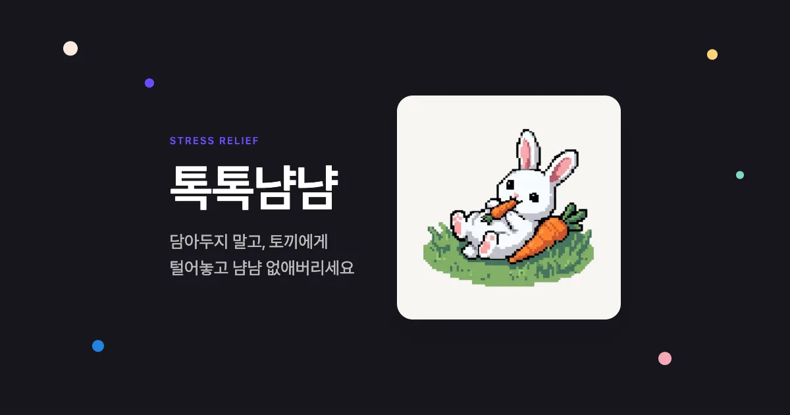
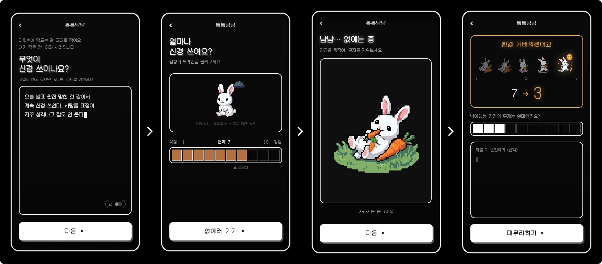
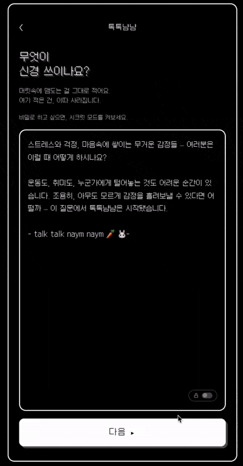
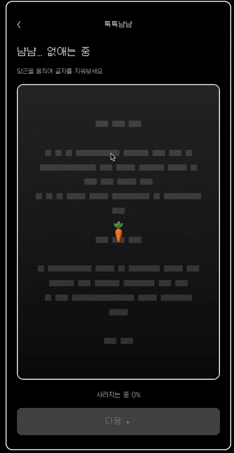

# 톡톡냠냠


<br/>

**쌓지 않고, 없애요** — 신경 쓰이는 걸 적고, 게임처럼 없애고, 가벼워져요
[지금 해보기 ▸](https://talktalk-naymnaym.vercel.app)

---

## 목차

- [서비스 설명](#서비스-설명)
- [기술 스택 & 시작하기](#기술-스택--시작하기)

---

## 서비스 설명

### 톡톡냠냠의 시작

스트레스와 걱정, 마음속에 쌓이는 무거운 감정들
여러분은 이럴 때 어떻게 하시나요?

운동도, 취미도, 누군가에게 털어놓는 것도 어려운 순간이 있어요. 조용히, 아무도 모르게 감정을 흘려보낼 수 있다면 어떨까?
이 질문에서 톡톡냠냠이 시작됐어요.

### 톡톡냠냠의 방향

일상을 기록하고 분석해주는 서비스는 많아요. 톡톡냠냠은 달라요.
당 떨어질 때 먹는 간식처럼, 감정을 털어내고 싶을 때 부담 없이 들러서 해소하고 다시 일상으로 돌아갈 수 있는 서비스예요.

#### 🔒 완전한 비밀 보장

작성한 감정 기록은 서버, 브라우저 어디에도 남지 않아요.
시크릿 모드를 켜면 외부에 들키고 싶지 않은 이야기도 안심하고 적을 수 있어요.

#### 🥕 해결이 아닌 해소

톡톡냠냠은 감정을 분석하지 않아요.
분석의 무게까지 느끼고 싶지 않을 때, 빠르게 털어내고 일상으로 돌아가고 싶을 때 써보세요.

### 어떻게 사용하나요

**적고 → 강도를 재고 → 당근으로 지우고 → 가벼워진다**



#### "🤫 비밀 이야기는 시크릿 모드를 사용해보세요."



#### "🐰 감정 기록을 지우면 귀여운 토끼가 나타나요."



---

## 기술 스택 & 시작하기

### 기술 스택

| 분류     | 기술              |
| -------- | ----------------- |
| Frontend | React, TypeScript |
| Build    | Vite              |
| Styling  | CSS Modules       |
| State    | Zustand           |
| Test     | Vitest            |
| Deploy   | Vercel            |

### 시작하기

```bash
git clone https://github.com/<your-org>/toktok-nyamnyam.git
cd toktok-nyamnyam
pnpm install
pnpm dev
```
